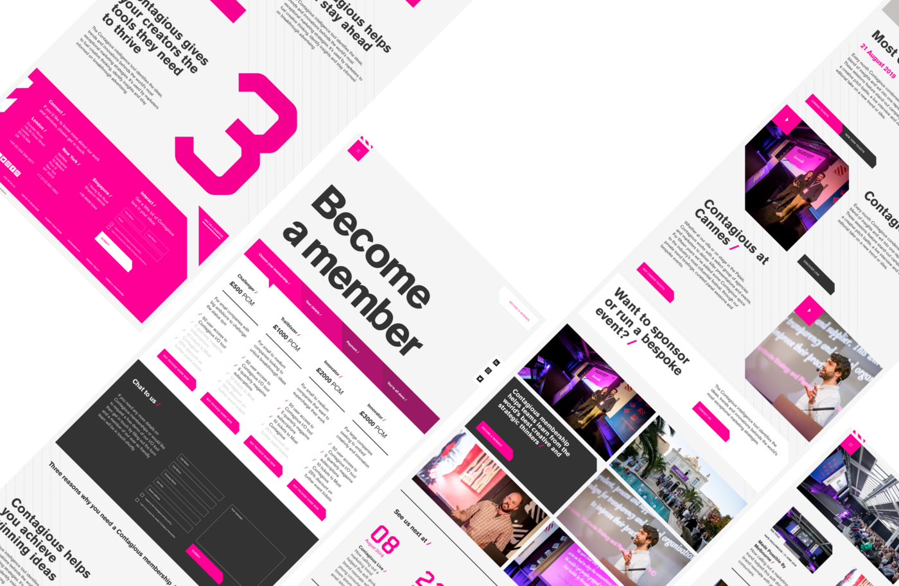
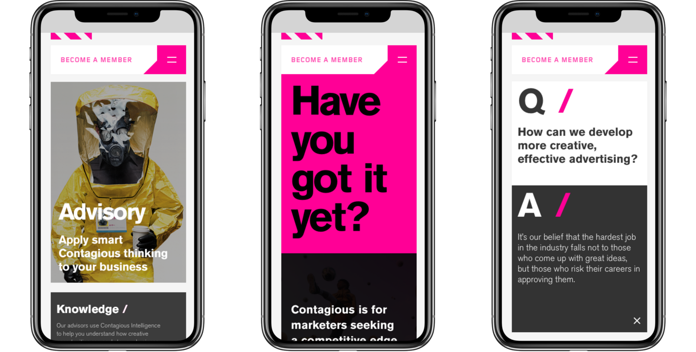

As my first major project at [Clock](https://clock.co.uk), I was part of the team working on the Contagious site. Contagious are all about creativity, and they needed a site that grabbed the attention of visitors and accurately communicated what they did as a company.

I played key part in a small team of front-end developers working on the site, so was 'thrown into the deep end' as such, this being my first real client project. I certainly learned a lot - this was the first project on which I used [Storybook](https://storybook.js.org) to prototype React components in isolation, a practise that I now use on all projects I undertake.

Later down the line, Contagious approached us again to redesign and build their subscriber platform, [Contagious I/O](https://contagious.com/io). This time around, I took on the role of lead front-end developer. Having already built a large portion of the .com site, I was able to re-use a lot of components and extend the existing styles for I/O, but also build a large amount of new functionality that was not previously required.

I/O is a much more 'functional' website than the .com - users can curate collections of articles, follow topics and brands, and receive newsletters and updates based on their interests. This much more dynamic behaviour exposed me to the complexities of building a platform like this one, and I worked closely with the software engineering team to produce the end result.

See Clock’s blog post on Contagious [here](https://www.clock.co.uk/work/infectious-web-design-for-contagious-com).

Credit: [Clock](https://clock.co.uk).
