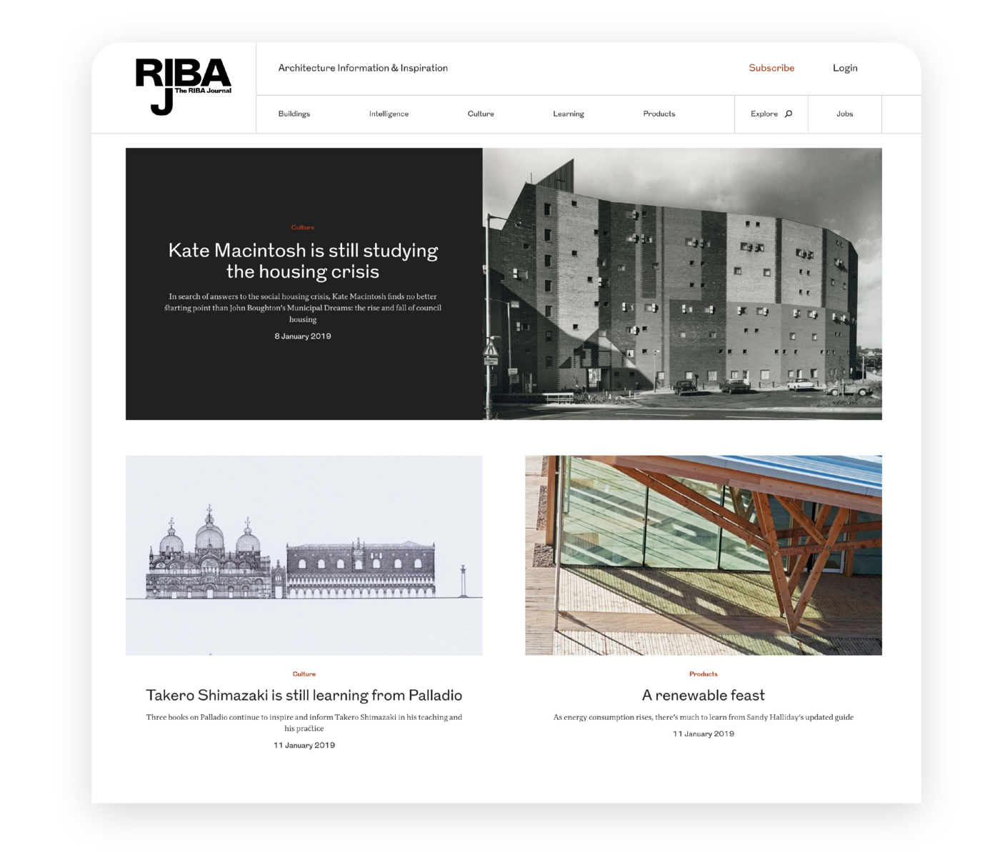
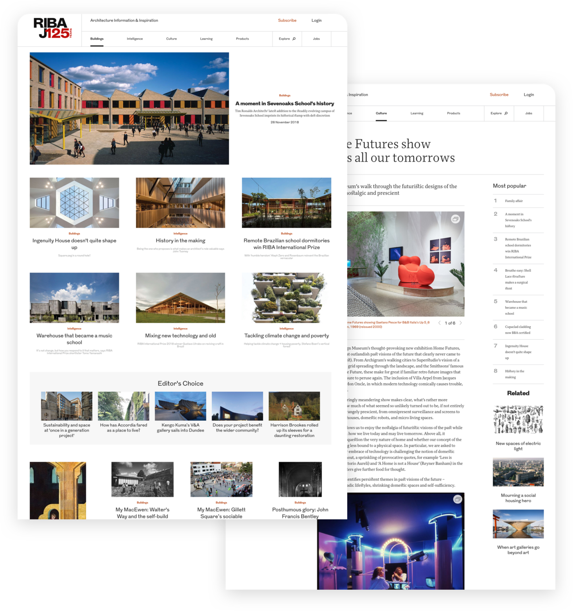

RIBAJ was a really nice site to work on - I only played a small part in the development of the redesign, but it was a very rewarding experience. Being one of Clock's older projects, it uses a legacy stack - it's build with Jade rather than React.

I built a few key components that made up parts of the redesign; things like the main hero and article grid, the most popular list, and the related articles widget you can see on the designs below.

The end result is a sleek, sophisticated website that is able to deliver the journal's vast amount of content in a tidy manner.

See Clock’s blog post on RIBAJ [here](https://www.clock.co.uk/work/riba-journal-raises-the-roof-with-new-redesign).

Credit: [Clock](https://clock.co.uk).
