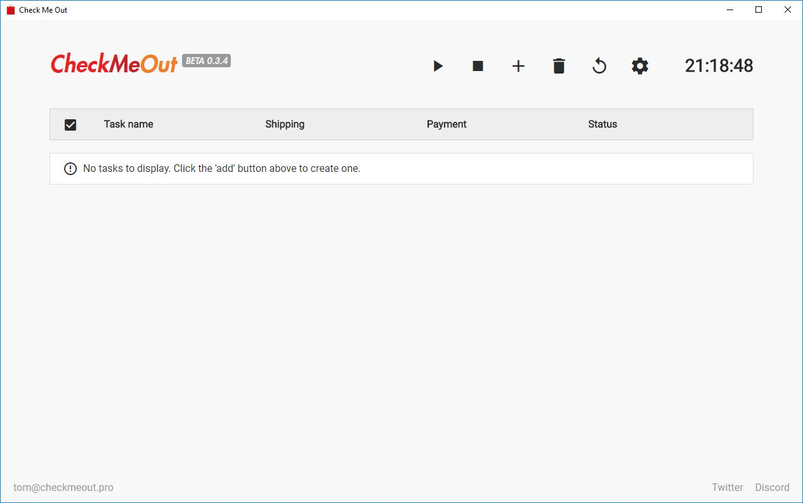

Built as a part of [Check Me Out](/experience/check-me-out), the Desktop bot is an advanced Supreme bot. It is built with Electron, a node.js framework for building desktop applications.

One of first bots to feature profiles - allowing users to store any number of payment methods and shipping addresses, and then assign them to different orders at the click of a button.

It was also the first bot (as far as I'm aware) to be able to run multiple order tasks _in parallel_, without just using requests - resulting a very high order success rate. Each task is launched in it's own independent browser session and commands are dispatched from the main process to each browser instance, fulfilling the tasks.

It also supports Google login to minimise the probability of having to complete a reCAPCTHA. Once logged in, your Google session cookies are injected into each browser instance at checkout time.

Now that Check Me Out is no longer operational as a company, the Desktop bot is 100% free and open source under the GNU GPLv3 license.
