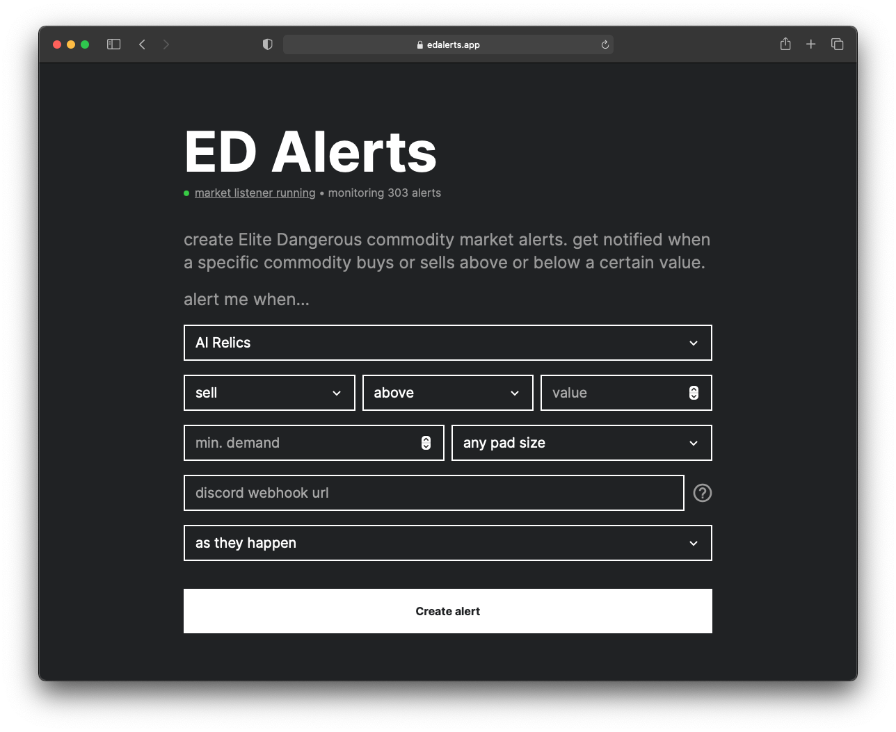

ED Alerts is a companion tool for the game [Elite Dangerous](https://www.elitedangerous.com).

Elite Dangerous is a space exploration game that includes among other things, an expansive network of trading posts and a large number of commodities that can be bought and sold at these posts.

Players are able to trade commodities across the galaxy — and make significant profits doing so.

Using ED Alerts, players can set up price alerts for any commodity in the galaxy and be notified when items sell above or below a set threshold. As the market can often fluctuate, and supply/demand can change quickly, it is important to be among the first players to know of a good trading opportunity in order to exploit it.

Players can add extra criteria for their alerts, such as landing pad size and supply/demand thresholds. Alerts are delivered via Discord webhooks.

ED Alerts works by watching messages from [EDDN](https://eddn.edcd.io/), a player-powered data network that reflects the state of the galaxy in real time.
