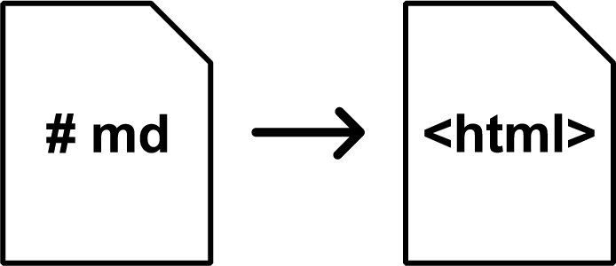

ssg is a simple static site generator, consisting of only ~300 lines of code, that takes a directory of Markdown files and outputs a directory of compiled HTML files.

Static assets such as images get copied over, and you can do cool things like include stylesheets and add support for KaTeX rendering and syntax highlighting. Both CSS and SASS/SCSS stylesheets are supported, with the latter being transpiled at build time.

Because it's so small, it's super fast - it will generate a medium sized website (10-20 pages) in a matter of seconds.

ssg was built mainly as a toy project to alleviate COVID-19 quarantine boredom over a couple of days.

Check out the GitHub repo below for full usage instructions and examples!
