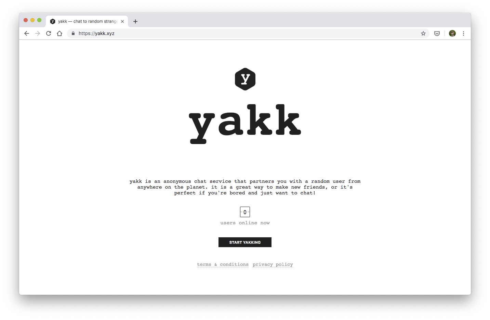

It is a great way to make new friends, or it's perfect if you're bored and just want to chat!

yakk is the result of my efforts to get to grips with React over the period of a few weeks. I was trying to come up with an application that was _reactive_ - a chat application is the perfect example of a very dynamic, stateful application.

The Express server maintains a list of connected clients in memory, and whether or not they are free (not currently in a chat). When you join, you will be connected randomly with one of these free users and will be able to start a conversation. When the conversation is over, find a new partner and start chatting with someone new.

Messages are delivered to the client via websockets, using the popular [socket.io](https://socket.io) library.

If no clients are free when you join, your client will retry a few times automatically, before timing out and letting you know that there is no one free. You can then search again manually.

View the source [here](https://github.com/tdjsnelling/yakk).
