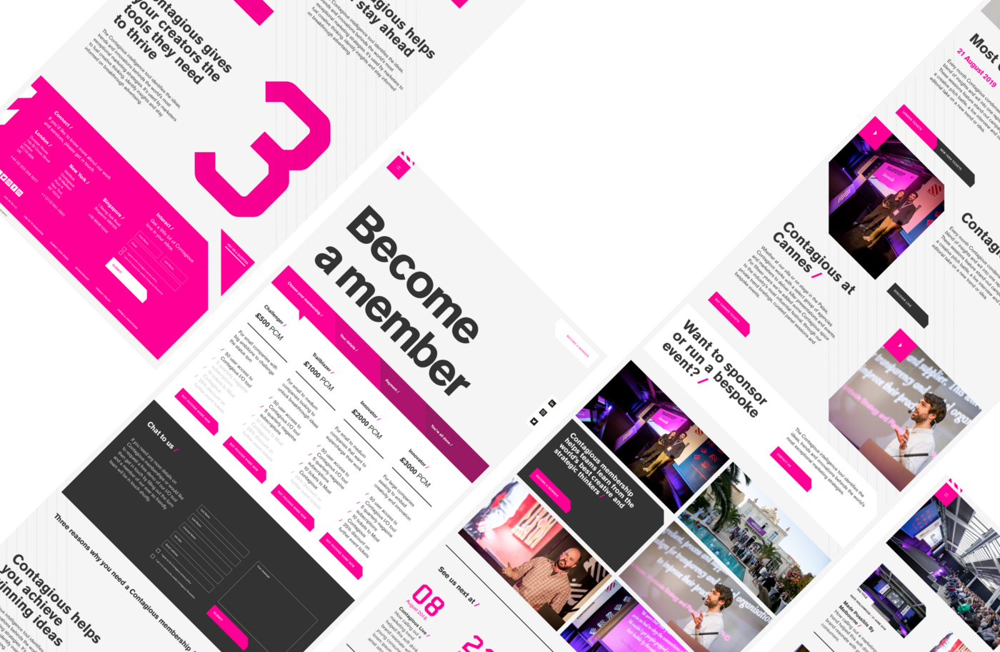
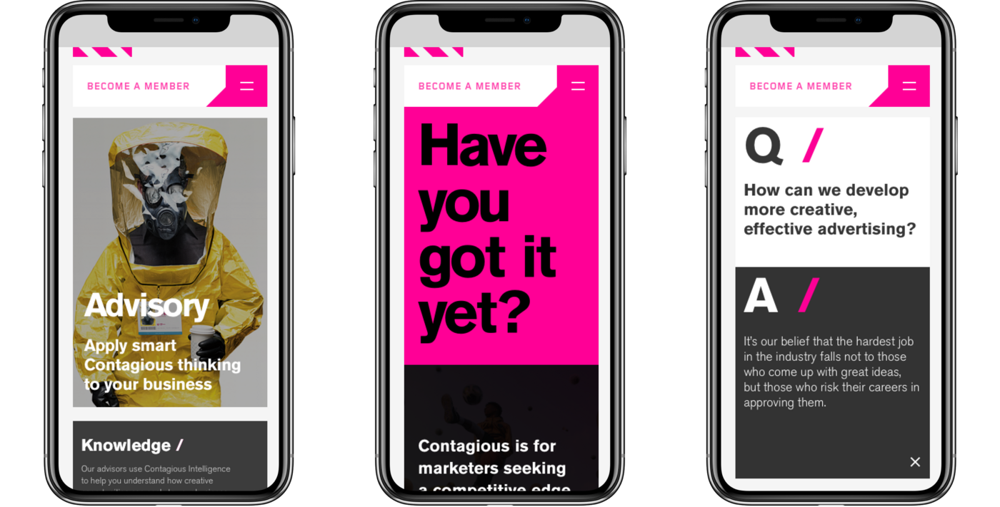

As my first major project at Clock, I was part of the team working on the contagious.com site. Being a market-leading marketing company, they needed a site that grabbed the attention of visitors and accurately communicated what they did as a company.

I was one of 2-3 front-end developers working on the site, so was 'thrown into the deep end' as such, this being my first big client project. I certainly learned a lot - this was the first project on which I used [Storybook](https://storybook.js.org) to prototype React components in isolation, a practise that I now use on all projects I undertake.

Later down the line, Contagious approached us again to redesign and build their subscriber platform, [I/O](https://contagious.com/io). Again, I played a large part in the front-end development of this project, and I am very proud of the results.

See Clock’s blog post on Contagious [here](https://www.clock.co.uk/work/infectious-web-design-for-contagious-com).

Credit: [Clock](https://clock.co.uk).
