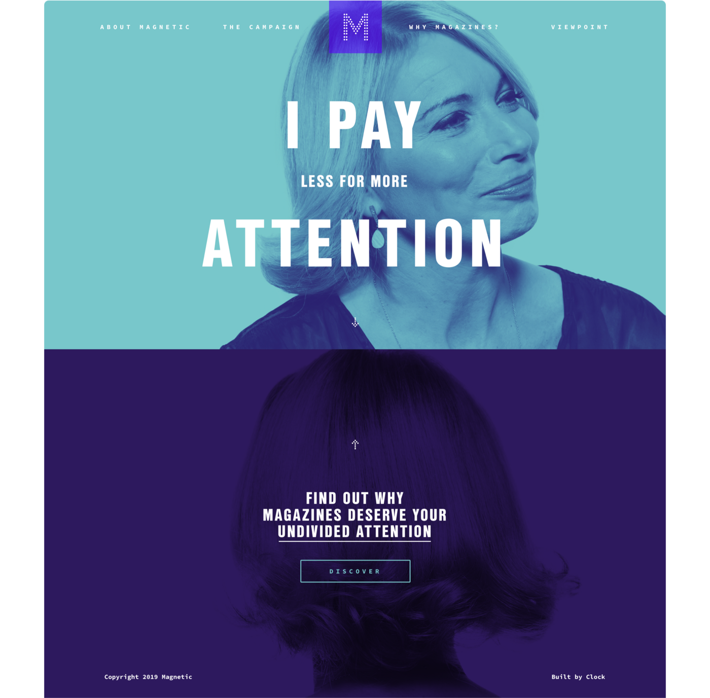
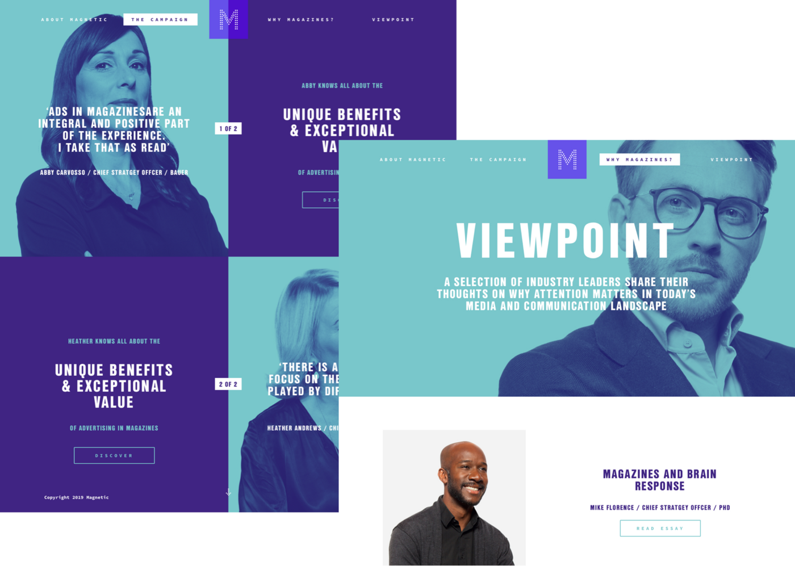

Magnetic Media were an existing client of Clock’s, so its no surprise that they came to us when planning their industry-wide 'Pay Attention' campaign. The main driving force behind the campaign was a desire to not only address but disprove the common perception in media today that magazines are an ineffective form of marketing and therefore unworthy of investment.

I was the sole developer on the Pay Attention site, so I worked closely with the lead designer on this project to achieve the outcome that the client desired.

The site is simple, fast, and effective. It's primary purpose is to deliver content from their campaign report, which is does excellently. A selection of industry leaders also shared viewpoints relating to the campaign, providing some article-like content for the site.

The site is built with [Gatsby](https://www.gatsbyjs.org/), an open-source React static site generator known for it's speed. Learning Gatsby was simple and rewarding, and I have used it for plenty of other static sites (including the one you are viewing now) since.

See Clock’s blog post on the campaign [here](https://www.clock.co.uk/work/attention-please-magnetic).

Credit: [Clock](https://clock.co.uk).
